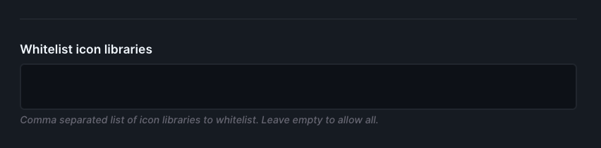
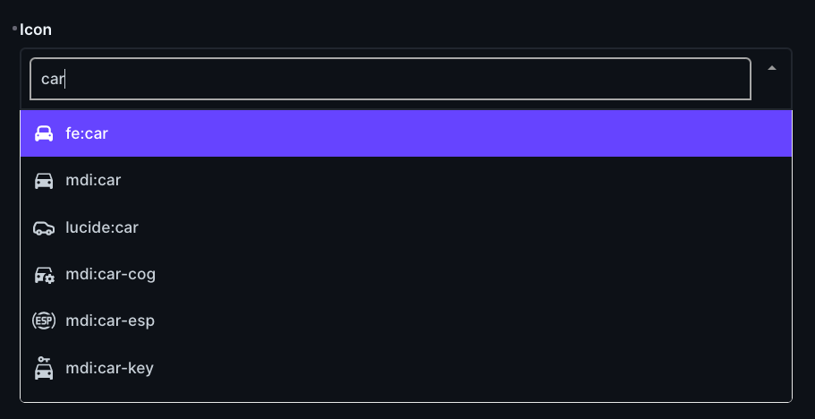
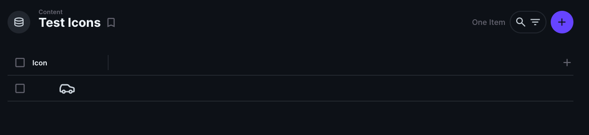
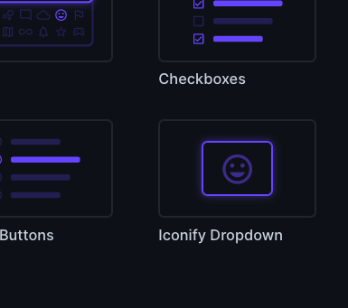

# directus-extension-iconify
This extension adds a field type to Directus that allows you to select an icon from the [Iconify](https://iconify.design/) library.  
It will save the icon name as string in the database.  
You can use the field in your frontend to display the icon by using one of the [Iconify components](https://iconify.design/docs/icon-components/).

## Installation
```bash
pnpm i directus-extension-iconify -D # with pnpm
yarn add directus-extension-iconify -D # with yarn
npm i directus-extension-iconify --save-dev # with npm
```

## Usage
 1. Go to your directus collection and create a new field
 2. Select Iconify Dropdown as field type within the group "Selection"
 3. Add your key
 4. If you to use a custom icon library, you can add it to the whitelist in the extension settings
 5. Click "Continue in Advance Field Creation Mode"
 6. Go to the Display tab and select "Iconify Icon" as display type
 7. Save the field

Now you can use the field in your collection.

## Options
Whitelist icon libraries to be used in the field:


## Preview



